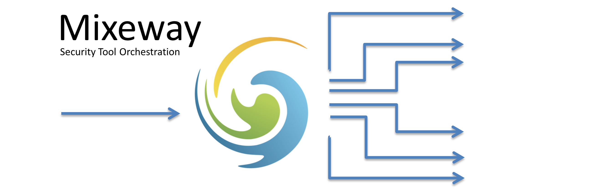
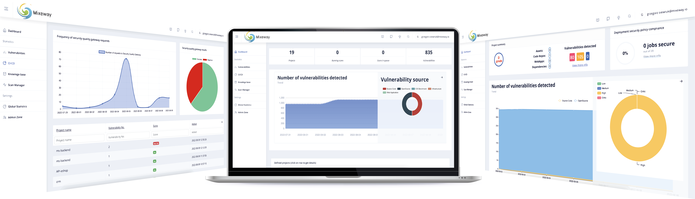
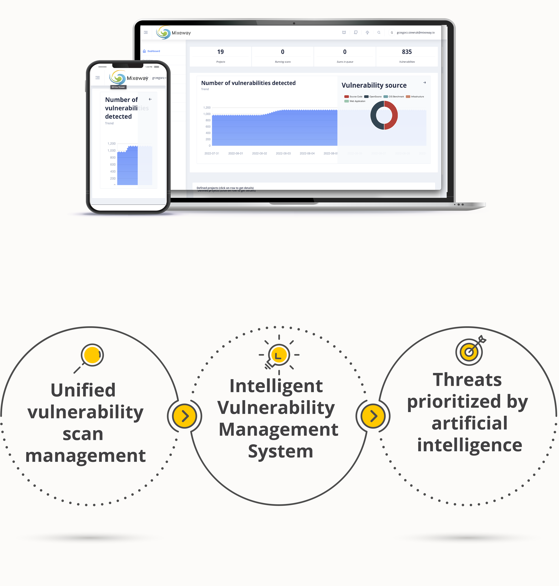

<a href="https://github.com/Mixeway/MixewayHub/blob/master/releasenote.md"></a>
<a href="hub.docker.comd"></a>

[](https://sonarcloud.io/dashboard?id=Mixeway_MixewayBackend)
[](https://sonarcloud.io/dashboard?id=Mixeway_MixewayBackend)



# Mixeway Hub 

### About Mixeway:
Mixeway is an OpenSource software that is meant to simplify the process of security assurance of projects which are implemented using CICD procedures. **Mixawey is not another vulnerability scanning
software - it is security orchestration tool**.

<a href="https://mixeway.github.io">Detailed documentation can be found here</a>

<a href="https://mixeway.io">More information and contact forms can be found here</a>



Mixeway is a middleware between CICD and Vulnerability Scanners. From user perspective it doesn’t matter which SAST, DAST, SCA or Network Scanner You are using – all integration is done by Mixeway in the background what makes the whole proces completely unified for the user/process.

With all this available, Mixeway provides functionalities to:
- Automatic service discovery (IaaS Plugin for assets and network scans for services)
- Automatic Vulnerability Scan Configuration (Based on most recent configuration) - hands-free!
- Automatic and on-demand Vulnerability scan execution (based on policy and executed via a REST API call)
- One Vulnerability Database for all type of sources - SAST, DAST, OpenSource and Infrastructure vulnerabilities in one place
- Customizable Security Quality Gateway - a reliable piece of information for CICD to decide if a job should pass or not.
- REST API enables integration with already used Vulnerability Management systems used within the organization.

Elements of a system:
- <a href="https://github.com/Mixeway/MixewayBackend">Backend - Spring Boot REST API</a>
- <a href="https://github.com/Mixeway/MixewayFrontend">Frontend - Angular 8 application </a>
- <a href="https://github.com/Mixeway/MixewayHub">MixewayHub - parent project which contain docker-compose and one click instalation </a>

### Vulnerability and Scan Management



With Mixeway You can:
* CONFIGURE AND RUN ANY SCAN - It doesn’t matter which vulnerability scanners You are using. With Mixeway integration running scans from GUI/API/CICD pipeline looks exactly the same no matter of scanning software.
* VULNERABILITY MANAGEMENT - Although Vulnerability Management is not main focus of Mixeway, we still serve some of the functionalities where You can browse through findings, see dashboard statistics or create JIRA tickets just by clicking on an issue.
* THREAT PRIORITIZATION - With Mixeway Vuln Auditor each detected threat is analyzed by Neural network and categorized as one of two: Relevant threat or not important/false positive. Thanks to that CyberSec Teams can focus only on serious threats

### Running Mixeway

Requirements:
* Installed unzip
* Docker and Docker-compose

```bash
# Create project directory
mkdir mixeway && cd "$_"
# Download latest release
wget https://github.com/Mixeway/MixewayHub/releases/download/v1.6.3/MixewayHub.zip
# Unzip contents
unzip MixewayHub.zip
# Run startup script
./startup.sh
# Run application
docker-compose up
```

`startup.sh` script is preparing `environment` variable and create self-signed certificates. As a result file with content is created:
```shell
FRONTEND_URL=https://localhost
KEYALIAS=localhost
TRUSTPASS=changeit
P12PASS=changeit
PROFILE=prod
CERTIFICATE=/pki/cert.crt
PRIVATEKEY=/pki/private.key
VAULT_ENABLED=false
```

<a href="https://mixeway.github.io/installation/">Description and other options are described in details in the linked documentation</a>

Mixeway will be avaliable at `https://<your_ip>`.

### Supported integrations

| Software | Type | Versions | Notes |
|----------|------|----------|-------|
| Acunetix | DAST Scanner | 10.0 + | Full scope | 
| Burp Enterprise Edition | DAST Scanner | 2021.10 + | Full scope |
| Fortify | SAST Scanner | 16,17,21 | Downnloading results, creating scan require additional software |
| Checkmarx | SAST Scanner | 9 + | Full Scope |
| Dependency Track | SCA Scanner | 3+ | Full Scope|
| Nexus IQ | SCA Scanner | 140+ | Full Scope - integration under development |
| Nessus | Network Scanner | 6 | Full Scope |
| GVM aka OpenVAS | Network Scanner | 18+ | Full Scope, require additional software|
| AWS | Cloud | na | Security groups, resources info download |
| OpenStack | Cloud | na | Security groups, resources info download |
| GCP | Cloud | na | Security groups, resources info download, integration under development |


### Mixeway Preview
